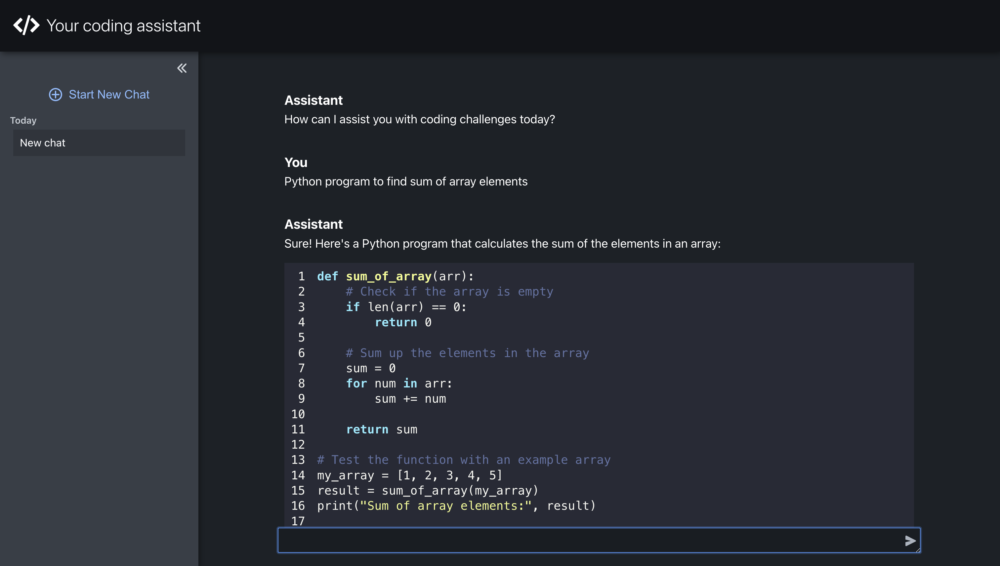

# GPT based coding assistant

Coding assistant is an Assistant powered by the Azure OpenAI's ChatGPT that aims to help users with coding challenges


## Contents

- [How to run](#how-to-run)
  - [docker compose](#docker-compose)
  - [local](#local)
- [How to use](#how-to-use)
- [DB Access](#db-access)

## How to run

### Docker compose

#### Installations

There are several ways to install docker:

- [Docker](https://docs.docker.com/engine/install/)
- [Rancher Desktop](https://rancherdesktop.io/) (good option for MacOS)
- [Podman](https://podman.io/)

`docker-compose` is also required. Check if you have `docker-compose` with the command `docker-compose --version`. If you don't have it, please, following the guides: [for Linux](https://docs.docker.com/compose/install/linux/) and [for MacOS](https://www.ionos.com/digitalguide/server/configuration/docker-compose-on-mac/):

#### Run with docker compose

1. Create `.env` file and copy the content of `.env.docker.example` to `.env`: `cp .env.docker.example .env`. You can use your DB env variables.
2. Set your Azure OpenAI API KEY and endpoint:

- AZURE_OPENAI_API_KEY=
- AZURE_OPENAI_ENDPOINT=
- AZURE_OPENAI_API_VERSION=

3. Run the docker compose:

```
docker-compose up
```

This will initialize postgresql database, backend service and frontend. Backend should be accessible on http://0.0.0.0:8000/. Frontend should be running on http://localhost:3000/.

To remove the created containers:

```
docker-compose down
```

### Run locally

Please, follow the instructions in coding-assistant-BE and coding-assistant-FE README files to run backend and frontend servers respectively. If everything is done sucessfully, you should have similar result as with docker compose.

## How to use



You can ask the assistant about simple coding challenges using the web interface. You will receive the answer with code snippets and comments. The assistant will not answer questions not related to programming requests.
You can have multiple chats (threads) which are independant of each other. You can delete and rename chats as you wish. Everything is going to be persisted.
